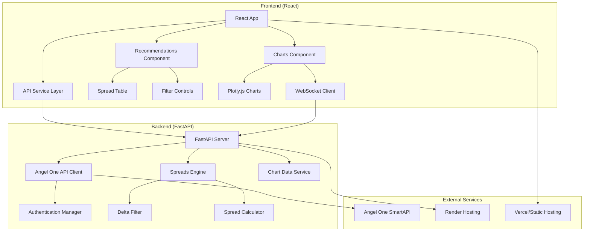

# Design Document

## Overview

The Option Spreads Analyzer is a full-stack web application that provides real-time option spread recommendations for NIFTY and BANKNIFTY indices. The system consists of a Python FastAPI backend that integrates with Angel One SmartAPI for market data, implements sophisticated spread analysis algorithms, and serves a React frontend with interactive charts and recommendation displays.

## Architecture



## Components and Interfaces

### Backend Components

#### 1. FastAPI Application (`main.py`)
- **Purpose**: Main application entry point and API route definitions
- **Endpoints**:
  - `GET /health`: Health check endpoint
  - `GET /api/status`: API and Angel One connection status
  - `GET /api/prices`: Current NIFTY and BANKNIFTY prices
  - `POST /api/recommendations`: Filtered option spread recommendations
  - `GET /api/recommendations/{symbol}`: Quick spread recommendations
  - `GET /api/gainers-losers`: Top gainers/losers in derivatives
  - `GET /api/chart-data`: Historical OHLC data for charts
  - `GET /api/websocket-info`: WebSocket connection information
- **Features**:
  - CORS middleware for cross-origin requests
  - GZip compression for responses
  - Custom error handlers for Angel One API errors
  - Application lifecycle management (startup/shutdown)
  - Auto-documentation with Swagger UI and ReDoc

#### 2. Angel One API Client (`angel_api.py`)
- **Purpose**: Handles all interactions with Angel One SmartAPI
- **Key Classes**:
  - `AngelOneError`: Custom exception with error code mapping
  - `AuthenticationManager`: Token management and session handling
  - `AngelOneClient`: Main API client with all market data methods
- **Key Methods**:
  - `authenticate()`: TOTP-based authentication with token refresh
  - `get_current_price()`: Real-time index prices (NIFTY/BANKNIFTY)
  - `get_option_greeks()`: Option Greeks data for specific expiry
  - `get_relevant_option_strikes()`: 6 strikes up/down from ATM
  - `get_top_gainers_losers()`: Derivatives market movers
  - `get_ohlc_data()`: Historical candlestick data
  - `logout()`: Session termination
- **Features**:
  - Automatic token refresh (28-hour session management)
  - Rate limiting and retry logic
  - Comprehensive error handling with 30+ error codes
  - WebSocket support for real-time data
  - Expiry date calculation (weekly for NIFTY, monthly for BANKNIFTY)

#### 3. Spreads Analysis Engine (`spreads.py`)
- **Purpose**: Core business logic for identifying optimal option spreads
- **Key Classes**:
  - `OptionContract`: Data model for individual options with Greeks
  - `SpreadRecommendation`: Complete spread analysis with P&L metrics
  - `SpreadAnalyzer`: Main analysis engine with delta filtering
- **Algorithm Flow**:
  1. **Data Parsing**: Convert Angel One API data to structured models
  2. **ATM Identification**: Find strike closest to current market price
  3. **Delta Filtering**: Filter options with delta difference 0.15-0.26
  4. **Spread Calculation**: Calculate Bull Call and Bear Put spreads
  5. **Risk Analysis**: Compute max profit/loss, breakeven, risk-reward ratios
  6. **P&L Projection**: Calculate profit/loss per 100-point movement
  7. **Ranking**: Sort by risk-reward ratio and liquidity
- **Key Features**:
  - **Lot Size Integration**: NIFTY (75), BANKNIFTY (35)
  - **Delta Range Compliance**: Strict 0.15-0.26 filtering
  - **ATM Buy Legs**: Always uses ATM strike as buy leg
  - **6 Strikes Range**: Exactly 6 strikes up/down from ATM
  - **Debit Spreads**: Bull Call and Bear Put structures only

### Data Models

#### Option Contract Model
```python
class OptionContract(BaseModel):
    strike: float                # Strike price
    premium: float              # Option premium (estimated)
    delta: float                # Option delta
    gamma: float                # Option gamma
    theta: float                # Option theta (time decay)
    vega: float                 # Option vega (volatility sensitivity)
    implied_volatility: float  # Implied volatility percentage
    volume: int                 # Trading volume
    option_type: OptionType     # CE (Call) or PE (Put)
    expiry: str                 # Expiry date
    symbol: str                 # NIFTY or BANKNIFTY
```

#### Spread Recommendation Model
```python
class SpreadRecommendation(BaseModel):
    type: SpreadType            # Bull Call Spread or Bear Put Spread
    symbol: str                 # NIFTY or BANKNIFTY
    expiry: str                 # Option expiry date
    
    # Buy leg (ATM)
    buy_strike: float           # ATM strike price
    buy_premium: float          # Buy leg premium
    buy_delta: float            # Buy leg delta
    
    # Sell leg (OTM)
    sell_strike: float          # OTM strike price
    sell_premium: float         # Sell leg premium
    sell_delta: float           # Sell leg delta
    
    # Spread metrics
    delta_difference: float     # buy_delta - sell_delta (0.15-0.26)
    net_premium: float          # Net debit paid
    max_profit: float           # Maximum profit potential
    max_loss: float             # Maximum loss (net premium)
    breakeven: float            # Breakeven point
    
    # P&L projections
    profit_per_100_up: float    # Profit if underlying moves up 100 points
    profit_per_100_down: float  # Profit if underlying moves down 100 points
    
    # Risk metrics
    risk_reward_ratio: float    # max_profit / max_loss
    probability_profit: float   # Estimated probability of profit
    total_volume: int           # Combined volume of both legs
```

### Frontend Components (Planned)

#### 1. Main Application (`App.jsx`)
- **Purpose**: Root component managing application state and layout
- **Features**:
  - Responsive grid layout
  - Real-time data fetching
  - Error boundary handling
  - Loading states management

#### 2. Recommendations Component (`RecommendationsTable.jsx`)
- **Purpose**: Displays option spread recommendations in interactive table
- **Features**:
  - Sortable columns (profit/loss, risk-reward, delta difference)
  - Color-coded profit/loss indicators
  - Expandable rows for detailed spread information
  - Filter controls for symbol selection
  - Auto-refresh every 30 seconds
  - Mobile-responsive design

#### 3. Charts Component (`MarketCharts.jsx`)
- **Purpose**: Real-time price visualization using Plotly.js
- **Features**:
  - Dual-axis overlay for NIFTY and BANKNIFTY
  - 1-minute candlestick charts
  - WebSocket-based real-time updates
  - Responsive design for mobile devices
  - Interactive zoom and pan controls

#### 4. API Service Layer (`apiService.js`)
- **Purpose**: Centralized API communication with backend
- **Methods**:
  - `fetchRecommendations()`: Get spread recommendations
  - `fetchCurrentPrices()`: Get current index prices
  - `fetchChartData()`: Retrieve historical OHLC data
  - `fetchGainersLosers()`: Get market movers
- **Features**:
  - Retry logic with exponential backoff
  - Request/response type definitions
  - Error handling and user notifications

## Algorithm Details

### Delta-Based Spread Selection

The core algorithm implements the requirements specification:

1. **Strike Selection**: Use exactly 6 strikes above and below ATM (13 total)
2. **ATM Identification**: `ATM = round(current_price / strike_interval) * strike_interval`
3. **Delta Filtering**: Find pairs where `|buy_delta - sell_delta|` ∈ [0.15, 0.26]
4. **Spread Types**:
   - **Bull Call Spread**: Buy ATM call, sell OTM call (higher strike)
   - **Bear Put Spread**: Buy ATM put, sell OTM put (lower strike)

### P&L Calculation Formula

```python
# For Bull Call Spread
max_profit = (sell_strike - buy_strike - net_premium) * lot_size
max_loss = net_premium * lot_size
breakeven = buy_strike + net_premium

# P&L per 100 points movement
profit_per_100_up = (buy_delta - sell_delta) * 100 * lot_size
profit_per_100_down = -(buy_delta - sell_delta) * 100 * lot_size

# Risk-reward ratio
risk_reward_ratio = max_profit / max_loss
```

### Ranking Algorithm

Spreads are ranked by:
1. **Primary**: Risk-reward ratio (higher is better)
2. **Secondary**: Total volume (higher liquidity preferred)
3. **Tertiary**: Delta difference (closer to 0.20 preferred)

## Error Handling Strategy

### Backend Error Handling
- **Angel One API Errors**: 30+ specific error codes mapped to user-friendly messages
- **Authentication Failures**: Automatic token refresh with fallback re-authentication
- **Rate Limiting**: Exponential backoff with request queuing
- **Data Validation**: Pydantic models for request/response validation
- **Logging**: Structured logging with different levels (INFO, WARNING, ERROR)

### Frontend Error Handling (Planned)
- **Network Errors**: Retry mechanism with user notification
- **Data Loading States**: Loading spinners and skeleton screens
- **API Failures**: Graceful degradation with cached data when possible
- **User Feedback**: Toast notifications for errors and success states

## Performance Optimization

### Backend Performance
- **Async Operations**: FastAPI's async capabilities for concurrent API calls
- **Connection Pooling**: Efficient HTTP client for Angel One API
- **Response Compression**: GZip middleware for large responses
- **Caching Strategy**: Optional Redis cache for frequently accessed data

### Frontend Performance (Planned)
- **Code Splitting**: Lazy load components to reduce initial bundle size
- **Memoization**: React.memo and useMemo for expensive calculations
- **Chart Optimization**: Limit data points and use efficient rendering
- **Bundle Optimization**: Tree shaking and minification for production

## Security Considerations

### API Security
- **Environment Variables**: All sensitive credentials stored in .env files
- **CORS Configuration**: Restricted origins in production
- **Input Validation**: Sanitize all user inputs and API parameters
- **Rate Limiting**: Request throttling to prevent abuse

### Deployment Security
- **HTTPS**: Enforce SSL/TLS for all communications
- **Secret Management**: Use Render's environment variable management
- **API Keys**: Secure storage and rotation of Angel One API keys
- **Monitoring**: Log security events and API usage patterns

## Deployment Architecture

### Backend Deployment (Render)
- **Runtime**: Python 3.11+
- **Start Command**: `uvicorn main:app --host 0.0.0.0 --port $PORT`
- **Environment Variables**: Angel One API credentials, CORS origins
- **Health Checks**: `/health` endpoint for monitoring
- **Auto-scaling**: Based on CPU and memory usage

### Frontend Deployment (Vercel/Static)
- **Build Command**: `npm run build`
- **Output Directory**: `dist` or `build`
- **Environment Variables**: Backend API URL
- **CDN**: Global CDN for static assets
- **Auto-deployment**: Git-based deployment pipeline

## Testing Strategy

### Backend Testing
- **Unit Tests**: Individual function testing with pytest
- **Integration Tests**: API endpoint testing with httpx
- **Mock Testing**: Angel One API responses with realistic data
- **Performance Tests**: Load testing for concurrent requests

### Frontend Testing (Planned)
- **Component Tests**: React Testing Library for component behavior
- **Integration Tests**: API service layer with mock backend
- **E2E Tests**: Critical user flows with Cypress
- **Visual Tests**: Screenshot testing for chart rendering

## Monitoring and Observability

### Metrics Collection
- **API Response Times**: Track endpoint performance
- **Error Rates**: Monitor API failure rates
- **User Activity**: Track feature usage patterns
- **System Health**: CPU, memory, and network metrics

### Logging Strategy
- **Structured Logging**: JSON format for easy parsing
- **Log Levels**: DEBUG, INFO, WARNING, ERROR, CRITICAL
- **Request Tracing**: Unique request IDs for debugging
- **Performance Logging**: API call durations and bottlenecks

## Scalability Considerations

### Horizontal Scaling
- **Stateless Design**: No server-side session storage
- **Load Balancing**: Multiple backend instances
- **Database Scaling**: Optional read replicas for caching
- **CDN Integration**: Static asset distribution

### Vertical Scaling
- **Resource Optimization**: Efficient memory usage
- **Connection Pooling**: Reuse HTTP connections
- **Async Processing**: Non-blocking I/O operations
- **Caching Strategy**: Reduce API calls with intelligent caching